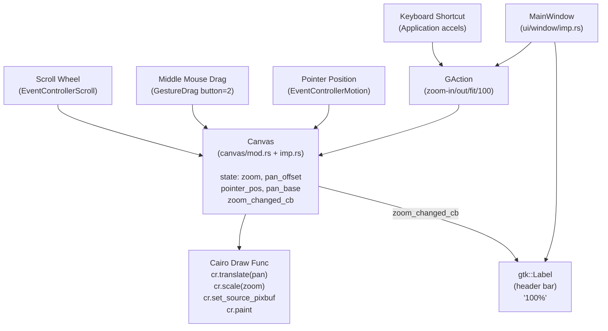

# Canvas and Navigation — Design

**Spec:** `.specs/features/canvas-and-navigation/spec.md`  
**Status:** Approved

---

## Architecture Overview

PRD-002 extends the existing `Canvas` GObject widget (created in PRD-001) with zoom and pan state, updates the Cairo rendering pipeline to apply the transform, and wires event controllers for scroll zoom and middle-mouse pan. The `MainWindow` gains a zoom label in the header bar and four new `GAction`s with keyboard accelerators.

No new modules or files are created. All changes are additive modifications to existing files.



**Key architectural decisions:**
- Zoom/pan state lives entirely in `canvas/imp.rs` — the Canvas widget owns its navigation state (consistent with PRD-001 design where Canvas owns `image`)
- Zoom changes are communicated to the header label via a stored callback closure (`zoom_changed_cb`) — avoids full GObject property registration while keeping concerns separated
- Event controllers and gestures are added inside `Canvas::new()` in `mod.rs` — consistent with existing draw func setup pattern
- Keyboard accelerators are registered in `Application::startup()` — the GTK4-correct location for app-wide action accelerators
- Pan has no boundary clamping — users can move the image off-screen and recover with fit-to-window (spec CNAV-05 AC-6)

---

## Code Reuse Analysis

### Existing Components to Leverage

| Component | Location | How to Use |
|---|---|---|
| `Canvas` GObject subclass | `src/canvas/imp.rs` | Extend with zoom/pan state fields |
| `Canvas::new()` + `set_draw_func` | `src/canvas/mod.rs` | Update draw closure; add event controllers inside same init |
| `MainWindow` GObject + `ObjectImpl::constructed` | `src/ui/window/imp.rs` | Add zoom_label field; connect zoom callback after canvas init |
| `gio::SimpleAction` pattern | `src/ui/window/imp.rs` | Same pattern as existing `new-screenshot` / `open-file` actions |
| `adw::HeaderBar` + `pack_end` | `src/ui/window/imp.rs` | Pack zoom buttons and label into header bar |

### Integration Points

| System | Integration Method |
|---|---|
| Cairo rendering pipeline | Add `cr.translate(pan_x, pan_y)` + `cr.scale(zoom, zoom)` before `set_source_pixbuf` in draw func |
| GTK4 event system | `gtk::EventControllerScroll` (scroll zoom), `gtk::GestureDrag` with `set_button(2)` (pan), `gtk::EventControllerMotion` (pointer tracking) |
| `Application::startup()` | Override in `application.rs` imp to call `app.set_accels_for_action()` for zoom shortcuts |

---

## Source Structure (changes only)

```
src/
├── application.rs          # MODIFIED: add startup() to register zoom keyboard accels
├── canvas/
│   ├── imp.rs              # MODIFIED: add zoom, pan_offset, pointer_pos, pan_base, zoom_changed_cb fields
│   └── mod.rs              # MODIFIED: update draw func + add zoom API + event controllers
└── ui/window/
    ├── imp.rs              # MODIFIED: add zoom_label field + header zoom UI + callback connection
    └── mod.rs              # MODIFIED: add zoom GActions (zoom-in/out/fit/100)
```

---

## Components

### `canvas/imp.rs` — Canvas State Extension

- **Purpose:** Add zoom, pan, and pointer-tracking state needed for navigation
- **Location:** `src/canvas/imp.rs`
- **New fields added to `struct Canvas`:**

```rust
pub struct Canvas {
    // Existing (PRD-001)
    pub image: RefCell<Option<ImageData>>,

    // New (PRD-002)
    pub zoom: Cell<f64>,                          // current zoom factor [0.1, 8.0]; default 1.0
    pub pan_offset: Cell<(f64, f64)>,             // (pan_x, pan_y) in device pixels; default (0.0, 0.0)
    pub pointer_pos: Cell<(f64, f64)>,            // last known cursor position in widget coords
    pub pan_base: Cell<(f64, f64)>,               // pan_offset captured at drag-begin, for delta math
    pub zoom_changed_cb: RefCell<Option<Box<dyn Fn(f64)>>>, // called after every zoom change
}
```

- **Default values:** `zoom = Cell::new(1.0)`, all others `Cell::default()` / `RefCell::default()`
- **Note:** `f64` is `Copy` — use `Cell<f64>` and `Cell<(f64,f64)>` instead of `RefCell` for those fields
- **Reuses:** Existing `RefCell<Option<ImageData>>` pattern

---

### `canvas/mod.rs` — Draw Function + Zoom API + Event Controllers

- **Purpose:** Apply zoom/pan transform in rendering; expose public zoom API; wire event controllers
- **Location:** `src/canvas/mod.rs`

#### Updated Draw Function

Replace the existing draw closure inside `Canvas::new()`:

```rust
canvas.set_draw_func(move |widget, cr, _width, _height| {
    let imp = widget.imp();
    let zoom = imp.zoom.get();
    let (pan_x, pan_y) = imp.pan_offset.get();

    if let Some(image) = imp.image.borrow().as_ref() {
        cr.translate(pan_x, pan_y);
        cr.scale(zoom, zoom);
        cr.set_source_pixbuf(image.pixbuf(), 0.0, 0.0);
        // Bilinear interpolation (satisfies CNAV-08)
        if let Ok(pattern) = cr.source() {
            pattern.set_filter(cairo::Filter::Bilinear);
        }
        let _ = cr.paint();
    } else {
        // Placeholder fill (unchanged from PRD-001)
        cr.set_source_rgb(0.12, 0.12, 0.12);
        cr.rectangle(0.0, 0.0, _width as f64, _height as f64);
        let _ = cr.fill();
    }
});
```

> ⚠️ **Verify before implementing:** Confirm that `cr.source()` returns a pattern that exposes `set_filter()` in the `gtk4-rs` / `cairo-rs` bindings in use. If not available, the draw func works correctly without it (Cairo defaults to `Filter::Good` which is bilinear).

#### Public Zoom API Methods

```rust
impl Canvas {
    // Constants
    const ZOOM_MIN: f64 = 0.1;
    const ZOOM_MAX: f64 = 8.0;
    const ZOOM_STEP: f64 = 1.25;   // button/keyboard zoom step
    const SCROLL_STEP: f64 = 1.1;  // scroll wheel zoom step

    pub fn zoom_in(&self) {
        self.apply_zoom(self.imp().zoom.get() * Self::ZOOM_STEP, None);
    }

    pub fn zoom_out(&self) {
        self.apply_zoom(self.imp().zoom.get() / Self::ZOOM_STEP, None);
    }

    pub fn zoom_100(&self) {
        let zoom = 1.0;
        let cx = self.width() as f64 / 2.0;
        let cy = self.height() as f64 / 2.0;
        let (iw, ih) = self.image_size();
        let pan_x = cx - iw / 2.0;
        let pan_y = cy - ih / 2.0;
        self.imp().zoom.set(zoom);
        self.imp().pan_offset.set((pan_x, pan_y));
        self.notify_zoom_changed(zoom);
        self.queue_draw();
    }

    pub fn fit_to_window(&self) {
        let cw = self.width() as f64;
        let ch = self.height() as f64;
        if cw <= 0.0 || ch <= 0.0 { return; }  // not yet allocated
        let (iw, ih) = self.image_size();
        if iw <= 0.0 || ih <= 0.0 { return; }  // no image
        let zoom = (cw / iw).min(ch / ih).clamp(Self::ZOOM_MIN, Self::ZOOM_MAX);
        let pan_x = (cw - iw * zoom) / 2.0;
        let pan_y = (ch - ih * zoom) / 2.0;
        self.imp().zoom.set(zoom);
        self.imp().pan_offset.set((pan_x, pan_y));
        self.notify_zoom_changed(zoom);
        self.queue_draw();
    }

    pub fn zoom_level(&self) -> f64 {
        self.imp().zoom.get()
    }

    pub fn on_zoom_changed(&self, cb: impl Fn(f64) + 'static) {
        self.imp().zoom_changed_cb.replace(Some(Box::new(cb)));
    }

    // Private: unified zoom application with optional cursor anchor (device coords)
    fn apply_zoom(&self, raw_zoom: f64, anchor: Option<(f64, f64)>) {
        let old_zoom = self.imp().zoom.get();
        let new_zoom = raw_zoom.clamp(Self::ZOOM_MIN, Self::ZOOM_MAX);
        if (new_zoom - old_zoom).abs() < f64::EPSILON { return; }

        let (old_pan_x, old_pan_y) = self.imp().pan_offset.get();
        let (ax, ay) = anchor.unwrap_or((self.width() as f64 / 2.0, self.height() as f64 / 2.0));

        // Zoom-to-anchor: the image point under anchor stays fixed
        // img_point = (anchor - pan) / old_zoom
        // new_pan = anchor - img_point * new_zoom
        let new_pan_x = ax - (ax - old_pan_x) * (new_zoom / old_zoom);
        let new_pan_y = ay - (ay - old_pan_y) * (new_zoom / old_zoom);

        self.imp().zoom.set(new_zoom);
        self.imp().pan_offset.set((new_pan_x, new_pan_y));
        self.notify_zoom_changed(new_zoom);
        self.queue_draw();
    }

    fn image_size(&self) -> (f64, f64) {
        self.imp()
            .image
            .borrow()
            .as_ref()
            .map(|img| (img.width() as f64, img.height() as f64))
            .unwrap_or((0.0, 0.0))
    }

    fn notify_zoom_changed(&self, zoom: f64) {
        if let Some(cb) = self.imp().zoom_changed_cb.borrow().as_ref() {
            cb(zoom);
        }
    }
}
```

#### Event Controllers (added inside `Canvas::new()`)

**Pointer tracking (for zoom-to-cursor anchor):**
```rust
let motion = gtk::EventControllerMotion::new();
let canvas_weak = canvas.downgrade();
motion.connect_motion(move |_, x, y| {
    if let Some(c) = canvas_weak.upgrade() {
        c.imp().pointer_pos.set((x, y));
    }
});
canvas.add_controller(motion);
```

**Scroll-wheel zoom:**
```rust
let scroll = gtk::EventControllerScroll::new(
    gtk::EventControllerScrollFlags::VERTICAL
);
let canvas_weak = canvas.downgrade();
scroll.connect_scroll(move |_, _dx, dy| {
    if let Some(c) = canvas_weak.upgrade() {
        // dy > 0 = wheel down = zoom out; dy < 0 = wheel up = zoom in
        let factor = if dy < 0.0 { Canvas::SCROLL_STEP } else { 1.0 / Canvas::SCROLL_STEP };
        let anchor = c.imp().pointer_pos.get();
        c.apply_zoom(c.imp().zoom.get() * factor, Some(anchor));
    }
    glib::Propagation::Stop
});
canvas.add_controller(scroll);
```

**Middle-mouse pan:**
```rust
let drag = gtk::GestureDrag::new();
drag.set_button(2);  // middle mouse button
let canvas_weak_begin = canvas.downgrade();
drag.connect_drag_begin(move |_, _x, _y| {
    if let Some(c) = canvas_weak_begin.upgrade() {
        c.imp().pan_base.set(c.imp().pan_offset.get());
        c.set_cursor_from_name(Some("grabbing"));
    }
});
let canvas_weak_update = canvas.downgrade();
drag.connect_drag_update(move |_, offset_x, offset_y| {
    if let Some(c) = canvas_weak_update.upgrade() {
        let (base_x, base_y) = c.imp().pan_base.get();
        c.imp().pan_offset.set((base_x + offset_x, base_y + offset_y));
        c.queue_draw();
    }
});
let canvas_weak_end = canvas.downgrade();
drag.connect_drag_end(move |_, _, _| {
    if let Some(c) = canvas_weak_end.upgrade() {
        c.set_cursor_from_name(None);
    }
});
canvas.add_controller(drag);
```

> ⚠️ **Verify before implementing:** Confirm `GestureDrag::connect_drag_begin` receives `(gesture, x, y)` or `(gesture, start_x, start_y)` in the gtk4-rs binding version in use. Also confirm `set_cursor_from_name` is available on `Widget`. Alternatives: `gdk::Cursor::from_name("grabbing", None)` + `widget.set_cursor(cursor.as_ref())`.

---

### `ui/window/imp.rs` — Zoom Label + Callback Connection

- **Purpose:** Add zoom level label to the header bar and connect it to the canvas zoom callback
- **Location:** `src/ui/window/imp.rs`

**New field on `struct MainWindow`:**
```rust
pub struct MainWindow {
    pub(crate) canvas: OnceCell<Canvas>,
    pub(crate) zoom_label: OnceCell<gtk::Label>,  // NEW
}
```

**In `ObjectImpl::constructed`**, after creating the canvas and before building the header bar:

```rust
// Create zoom label
let zoom_label = gtk::Label::new(Some("100%"));
self.zoom_label.set(zoom_label.clone()).expect("zoom_label initialized once");

// Connect canvas zoom callback → updates label
canvas.on_zoom_changed(move |zoom| {
    zoom_label.set_label(&format!("{}%", (zoom * 100.0).round() as i32));
});
```

**In the header bar construction:**
```rust
header.pack_end(&zoom_label);
// also pack zoom buttons (see below)
```

---

### `ui/window/mod.rs` — Zoom GActions

- **Purpose:** Register `zoom-in`, `zoom-out`, `zoom-fit`, `zoom-100` actions on the window action group
- **Location:** `src/ui/window/mod.rs` (or `imp.rs` — consistent with existing action registration location)

Four new `gio::SimpleAction`s follow the exact same pattern as existing `new-screenshot` / `open-file` actions:

| Action name | Calls | Bound to |
|---|---|---|
| `win.zoom-in` | `canvas.zoom_in()` | `+` button in header |
| `win.zoom-out` | `canvas.zoom_out()` | `-` button in header |
| `win.zoom-fit` | `canvas.fit_to_window()` | `[]` button in header |
| `win.zoom-100` | `canvas.zoom_100()` | `1:1` button in header |

Actions are added to the existing `actions` `SimpleActionGroup` before `window.insert_action_group("win", ...)`.

**Header bar zoom controls (pack_end, right-to-left):**
```
[zoom_label] [1:1] [fit] [-] [+]   ← packed end (right side of header)
```

---

### `application.rs` — Keyboard Accelerators

- **Purpose:** Register keyboard accelerators for window zoom actions
- **Location:** `src/application.rs` (imp block)
- **Change:** Override `startup()` in `impl ApplicationImpl for Application`

```rust
fn startup(&self) {
    self.parent_startup();
    let app = self.obj();
    app.set_accels_for_action("win.zoom-in",  &["<Control>plus", "<Control>equal"]);
    app.set_accels_for_action("win.zoom-out", &["<Control>minus"]);
    app.set_accels_for_action("win.zoom-fit", &["<Control><Shift>f"]);
    app.set_accels_for_action("win.zoom-100", &["<Control>0"]);
}
```

> ⚠️ **Verify before implementing:** Confirm `ApplicationImpl::startup` is the correct override location in the `libadwaita`/`gtk4-rs` subclassing pattern in use. In GTK4, `startup` fires once before `activate` and is the correct place for app-wide accel registration.

---

## Data Models

No new data models. Navigation state is ephemeral and lives in the `Canvas` widget fields (not persisted — PRD-004 handles project persistence including view state).

---

## Error Handling Strategy

| Scenario | Handling | User Impact |
|---|---|---|
| `fit_to_window` called before widget is allocated (size = 0) | Early return, no-op | None — will work correctly once canvas is visible |
| Zoom clamped at 10% or 800% | Silently clamp, no error | Zoom stops changing — expected behavior |
| `set_cursor_from_name` fails (cursor name not found) | GTK logs a warning; cursor reverts to default | Pan still works, cursor feedback missing — acceptable |
| Cairo `cr.source()` unavailable for filter | Skip filter setting; use Cairo default (bilinear) | Image quality unaffected — Cairo default is bilinear |

---

## Tech Decisions

| Decision | Choice | Rationale |
|---|---|---|
| Zoom state storage | `Cell<f64>` in `imp.rs` | `f64` is `Copy`; `Cell` is simpler than `RefCell` for scalar values |
| Pan state storage | `Cell<(f64, f64)>` in `imp.rs` | Same rationale; tuples of `Copy` types are `Copy` |
| Zoom callback mechanism | Stored closure `RefCell<Option<Box<dyn Fn(f64)>>>` | Avoids GObject property registration overhead; single consumer (the label) is sufficient |
| Pointer position tracking | `EventControllerMotion` in canvas | Only reliable GTK4 way to get cursor coords for zoom-to-cursor anchor in scroll handler |
| Pan gesture | `GestureDrag` with `set_button(2)` | GTK4-native; provides drag delta math built-in; cleaner than raw `EventControllerLegacy` |
| Keyboard accels location | `Application::startup()` | GTK4 best practice; `startup` fires once before windows are created |
| Zoom step factor | 1.25× button, 1.1× scroll | 1.25× is one "visual step" per click (standard); 1.1× per scroll notch gives fine-grained control |
| Pan clamping | None | Per spec CNAV-05 AC-6; fit-to-window is the recovery action |
