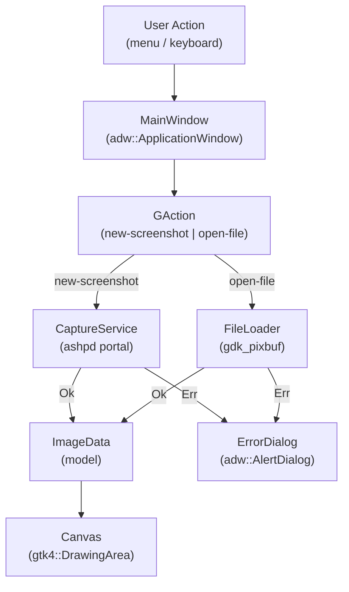

# Screenshot Capture and Loading — Design

**Spec:** `.specs/features/capture-and-loading/spec.md`  
**Status:** Approved

---

## Architecture Overview

This is the foundational module that establishes the entire application structure. Every subsequent milestone builds on top of the scaffolding created here.



**Key architectural decisions:**
- GTK4 objects always live on the main thread — async portal calls use `glib::spawn_future_local`
- Services are plain Rust structs (not GObjects) — they are called from GAction handlers inside the window
- The Canvas widget is a custom GObject subclass wrapping `gtk4::DrawingArea`
- No state management layer in Milestone 1 — the window holds a direct `Option<ImageData>` reference

---

## Code Reuse Analysis

### Existing Components to Leverage

This is a greenfield project. No existing code to reuse yet.

### Integration Points

| System | Integration Method |
|--------|-------------------|
| GNOME Screenshot Portal | `ashpd::desktop::screenshot::ScreenshotRequest` via async portal call |
| XDG file picker | `gtk4::FileDialog` (GTK4-native, replaces deprecated `FileChooserDialog`) |
| Image decoding | `gdk_pixbuf::Pixbuf::from_file()` for PNG/JPEG |
| Canvas rendering | `gtk4::DrawingArea::set_draw_func()` + Cairo context |

---

## Source Structure

```
src/
├── main.rs                       # Entry point: build Application, run
├── application.rs                # adw::Application GObject subclass
├── ui/
│   └── window/
│       ├── mod.rs                # MainWindow public API
│       └── imp.rs                # MainWindow GObject implementation (actions, signals)
├── capture/
│   ├── mod.rs                    # Re-exports CaptureService, FileLoader
│   ├── service.rs                # CaptureService: portal invocation via ashpd
│   └── loader.rs                 # FileLoader: PNG/JPEG loading via gdk_pixbuf
├── canvas/
│   ├── mod.rs                    # Canvas widget public API
│   └── imp.rs                    # Canvas GObject implementation (draw func, state)
└── models/
    └── image.rs                  # ImageData struct + SourceImage metadata
```

---

## Components

### `models/image.rs` — ImageData

- **Purpose:** Immutable value type representing a loaded image ready for display
- **Location:** `src/models/image.rs`
- **Interfaces:**
  - `ImageData::from_pixbuf(pixbuf: gdk_pixbuf::Pixbuf, source: SourceImage) -> Self`
  - `ImageData::pixbuf(&self) -> &gdk_pixbuf::Pixbuf`
  - `ImageData::source(&self) -> &SourceImage`
  - `ImageData::width(&self) -> i32`
  - `ImageData::height(&self) -> i32`
- **Dependencies:** `gdk_pixbuf`
- **Reuses:** Nothing (new struct)

```rust
pub struct ImageData {
    pixbuf: gdk_pixbuf::Pixbuf,
    source: SourceImage,
}

pub struct SourceImage {
    pub path: std::path::PathBuf,
    pub width: i32,
    pub height: i32,
}
```

---

### `capture/service.rs` — CaptureService

- **Purpose:** Invoke the GNOME Screenshot Portal and return an `ImageData`
- **Location:** `src/capture/service.rs`
- **Interfaces:**
  - `CaptureService::capture() -> Result<Option<ImageData>, CaptureError>`
    - Returns `Ok(None)` when user cancels (empty URI from portal)
    - Returns `Ok(Some(image))` on success
    - Returns `Err(CaptureError)` on portal failure or image load failure
- **Dependencies:** `ashpd`, `gdk_pixbuf`, `ImageData`
- **Reuses:** `FileLoader::load_from_path()` after receiving URI
- **Async:** Must be called with `glib::spawn_future_local` from the window

```rust
pub enum CaptureError {
    PortalUnavailable(String),
    PortalCancelled,
    ImageLoadFailed(String),
}
```

**Portal flow:**
```
ashpd::desktop::screenshot::Screenshot::request()
    → returns URI string
    → convert URI to PathBuf (strip "file://")
    → delegate to FileLoader::load_from_path()
```

---

### `capture/loader.rs` — FileLoader

- **Purpose:** Load a PNG or JPEG file from disk and return an `ImageData`
- **Location:** `src/capture/loader.rs`
- **Interfaces:**
  - `FileLoader::load_from_path(path: &Path) -> Result<ImageData, LoadError>`
  - `FileLoader::load_from_uri(uri: &str) -> Result<ImageData, LoadError>`
- **Dependencies:** `gdk_pixbuf`, `ImageData`
- **Reuses:** Nothing new

```rust
pub enum LoadError {
    FileNotFound(PathBuf),
    UnsupportedFormat(PathBuf),
    DecodeFailed(String),
    InvalidUri(String),
}
```

**Format detection:** Extension-based (.png, .jpg, .jpeg). `gdk_pixbuf` handles actual decoding and will return an error if the file is invalid despite the extension.

---

### `canvas/mod.rs` + `canvas/imp.rs` — Canvas

- **Purpose:** Custom GTK4 widget that displays an `ImageData` using Cairo
- **Location:** `src/canvas/`
- **Interfaces (public API via `mod.rs`):**
  - `Canvas::new() -> Self`
  - `Canvas::set_image(&self, image: &ImageData)`
  - `Canvas::clear(&self)`
- **Internal state (`imp.rs`):**
  - `image: RefCell<Option<ImageData>>`
- **Dependencies:** `gtk4`, `gdk_pixbuf`, `ImageData`
- **Rendering:** `gtk4::DrawingArea::set_draw_func()` — on each draw, if an image is set, paint it via `gdk::cairo::Context` using `set_source_pixbuf` + `paint()`
- **GObject subclass:** Uses `gtk4::glib::subclass` pattern (`ObjectSubclass` + `WidgetImpl`)

**Draw logic (Milestone 1 — no zoom/pan):**
```
if let Some(image) = self.image.borrow().as_ref() {
    context.set_source_pixbuf(image.pixbuf(), 0.0, 0.0);
    context.paint()?;
}
```

> Note: Zoom/pan will be added in Milestone 2 (PRD-002) by adding transform state to `imp.rs`.

---

### `ui/window/mod.rs` + `ui/window/imp.rs` — MainWindow

- **Purpose:** Application main window; owns GActions, the Canvas widget, and orchestrates capture/load flows
- **Location:** `src/ui/window/`
- **Interfaces (public API):**
  - `MainWindow::new(app: &adw::Application) -> Self`
- **GActions registered on the window:**
  - `new-screenshot` → calls `CaptureService::capture()` asynchronously
  - `open-file` → opens `gtk4::FileDialog`, calls `FileLoader::load_from_path()`
- **Internal state (`imp.rs`):**
  - `canvas: Canvas` (embedded in content area)
  - No image state owned by window — Canvas owns it directly
- **Dependencies:** `gtk4`, `libadwaita`, `Canvas`, `CaptureService`, `FileLoader`
- **Window structure:**
  ```
  adw::ApplicationWindow
  └── adw::ToolbarView
      ├── adw::HeaderBar (top)
      │   └── [New Screenshot button] [Open File button] [Menu button]
      └── Canvas (content)
  ```

---

### `application.rs` — Application

- **Purpose:** GApplication subclass; registers window type, creates main window on activate
- **Location:** `src/application.rs`
- **Interfaces:**
  - `Application::new() -> Self`
  - `Application::run() -> glib::ExitCode`
- **Dependencies:** `libadwaita`, `MainWindow`
- **App-level actions:** None in Milestone 1 (actions live on the window)

---

### `main.rs` — Entry Point

- **Purpose:** Create the Application and call `.run()`
- **Location:** `src/main.rs`
- **Dependencies:** `application.rs`

```rust
fn main() -> glib::ExitCode {
    Application::new().run()
}
```

---

## Data Models

### ImageData

```rust
// src/models/image.rs
pub struct ImageData {
    pixbuf: gdk_pixbuf::Pixbuf,
    source: SourceImage,
}

pub struct SourceImage {
    pub path: std::path::PathBuf,
    pub width: i32,
    pub height: i32,
}
```

**Relationships:** Owned by `Canvas` (inside `RefCell<Option<ImageData>>`). Created by `CaptureService` or `FileLoader`. Passed by reference to `Canvas::set_image()`.

---

## Error Handling Strategy

| Error Scenario | Handling | User Impact |
|---|---|---|
| Portal unavailable (no GNOME session) | `Err(CaptureError::PortalUnavailable)` → `adw::AlertDialog` | "Screenshot capture is not available in this environment." |
| User cancels portal | `Ok(None)` → no dialog, window just reappears | None — expected flow |
| Portal returns empty URI | Treated as cancellation | None |
| File not found | `Err(LoadError::FileNotFound)` → `adw::AlertDialog` | "The file could not be found." |
| File decode fails (corrupt/wrong format) | `Err(LoadError::DecodeFailed)` → `adw::AlertDialog` | "The file could not be loaded. It may be corrupt or in an unsupported format." |
| User cancels file picker | GTK `FileDialog` returns `Err` → ignored | None |

All errors are logged at `Error` level before showing the dialog.

---

## Tech Decisions

| Decision | Choice | Rationale |
|---|---|---|
| GObject subclassing for Canvas | Yes | Required to embed as a GTK4 widget inside `ToolbarView` |
| Async runtime for portal calls | `glib::spawn_future_local` | GTK must run on main thread; GLib's executor integrates with GTK event loop |
| Image format | `gdk_pixbuf::Pixbuf` | Validated in POC-002 and POC-003-04; simpler API for Milestone 1 |
| File picker | `gtk4::FileDialog` | GTK4-native async API, replaces deprecated `FileChooserDialog` |
| URI → Path conversion | Manual strip of `file://` scheme | `ashpd` returns raw URI strings; use `url::Url` crate or manual strip |
| Error dialog | `adw::AlertDialog` | Libadwaita-native, adaptive, consistent with GNOME HIG |

> ⚠️ **Verify before implementing:** Exact `ashpd` API for `Screenshot::request()` and the return type. Use Context7 or `ashpd` docs. Do not assume.  
> ⚠️ **Verify before implementing:** `glib::spawn_future_local` vs `gtk4::glib::MainContext::default().spawn_local()` — confirm the correct idiom for the crate version in use.
