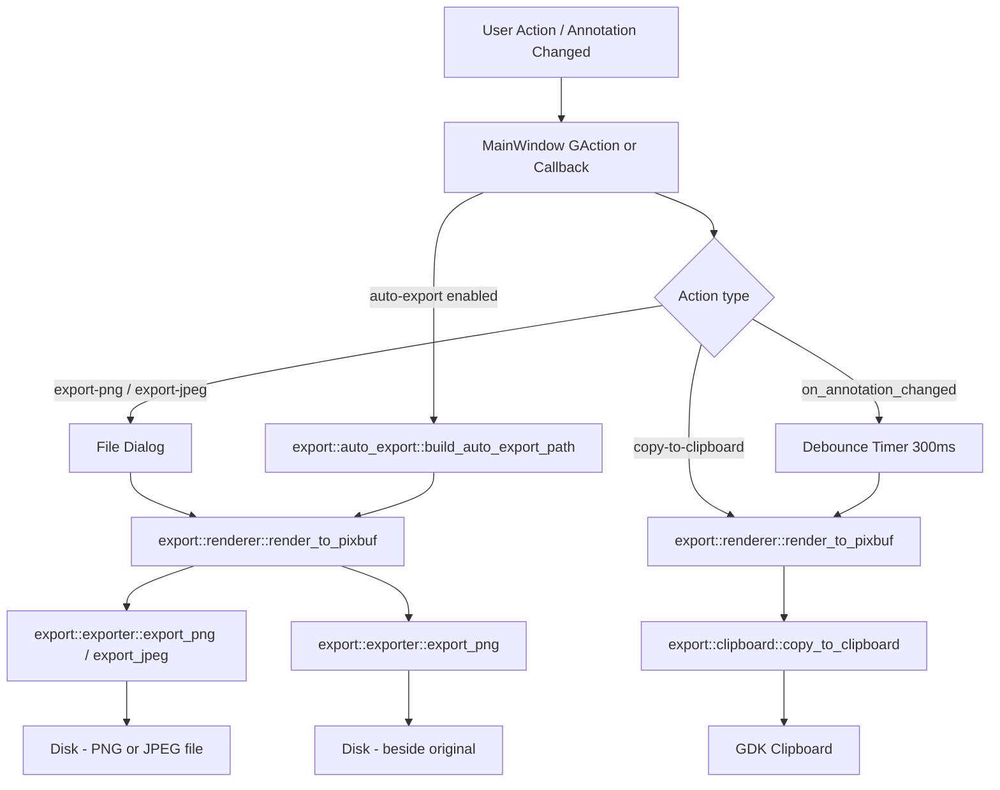

# Export and Clipboard Design

**Spec**: `.specs/features/export-and-clipboard/spec.md`
**Status**: Draft

---

## Architecture Overview

The feature introduces a new `src/export/` module (pure Rust, no GTK dependency on the logic layer) and extends the existing `MainWindow` with new GActions and auto-trigger logic.

The off-screen rendering pipeline reuses `src/canvas/renderer::draw_all` — this is the architectural guarantee from ADR-003: **canvas view == export result**.



---

## Code Reuse Analysis

### Existing Components to Leverage

| Component | Location | How to Use |
|---|---|---|
| Cairo renderer | `src/canvas/renderer.rs` | Call `draw_all` at zoom=1.0, pan=(0,0), selected_id=None for off-screen render |
| `Pixbuf` image storage | `src/canvas/imp.rs` (`image: RefCell<Option<ImageData>>`) | New `Canvas::source_pixbuf()` method exposes the source Pixbuf |
| `Canvas::all_annotations()` | `src/canvas/mod.rs` | Already returns `Vec<Annotation>` — used as-is for export |
| `on_annotation_changed` callback | `src/ui/window/imp.rs` | Extended with debounce + auto-export triggers |
| `PersistenceError` pattern | `src/persistence/error.rs` | Mirror this pattern for `ExportError` |
| `ProjectManager` field pattern | `src/ui/window/imp.rs` | Mirror for new `MainWindow` fields |
| `glib::spawn_future_local` | `src/ui/window/imp.rs` | Already used for async file dialogs — reuse for export dialogs |

### Integration Points

| System | Integration Method |
|---|---|
| GTK Cairo | `gtk::cairo::ImageSurface` for off-screen surface; `cr.set_source_pixbuf` for source image |
| GDK Clipboard | `gdk::Display::default()?.clipboard().set_texture(&texture)` |
| GDK Texture | `gdk::Texture::for_pixbuf(&pixbuf)` to convert Pixbuf → Texture for clipboard |
| glib Debounce | `glib::timeout_add_local_once(Duration::from_millis(300), ...)` returns `glib::SourceId`; `source_id.remove()` cancels |
| `Pixbuf::savev` | `pixbuf.savev(path, "png", &[], &[])` / `pixbuf.savev(path, "jpeg", &["quality"], &["90"])` |

---

## Rendering Pipeline (Off-Screen)

The key design decision: export renders at **native image resolution** (zoom=1.0, pan=0) using the same Cairo renderer as the canvas. Selection handles are excluded from export (selected_id=None).

```
cairo::ImageSurface::create(ARgb32, img_width, img_height)
    └─ cairo::Context::new(&surface)
        ├─ cr.set_source_pixbuf(source_pixbuf, 0.0, 0.0) → paint()   ← source image
        └─ renderer::draw_all(cr, annotations, None, Some(source), 1.0, 0.0, 0.0)  ← annotations
Surface → surface_to_pixbuf() → gdk_pixbuf::Pixbuf
    ├─ clipboard::copy_to_clipboard  →  gdk::Texture::for_pixbuf → clipboard.set_texture
    └─ exporter::export_png / export_jpeg  →  Pixbuf::savev("png"/"jpeg")
```

**ARGB32 → Pixbuf conversion**: Cairo's `Format::ARgb32` stores pixels as BGRA with premultiplied alpha (little-endian). Converting to `gdk_pixbuf::Pixbuf` (RGBA, straight alpha) requires byte-reordering and un-premultiplying alpha. This is handled by `surface_to_pixbuf` in `export/renderer.rs`.

---

## Components

### `src/export/renderer.rs`

- **Purpose**: Off-screen rendering — composites source image + annotations into a `Pixbuf`
- **Location**: `src/export/renderer.rs`
- **Interfaces**:
  - `pub fn render_to_pixbuf(source: &Pixbuf, annotations: &[Annotation]) -> Option<Pixbuf>` — main entry point
  - `fn surface_to_pixbuf(surface: &cairo::ImageSurface) -> Option<Pixbuf>` — private ARGB32→RGBA conversion
- **Dependencies**: `gtk::cairo`, `gdk_pixbuf::Pixbuf`, `crate::canvas::renderer::draw_all`, `crate::annotations::Annotation`
- **Reuses**: `crate::canvas::renderer::draw_all` (ADR-003 guarantee)
- **Note**: Requires `pub(crate) mod renderer;` in `src/canvas/mod.rs` (currently private)

### `src/export/auto_export.rs`

- **Purpose**: Computes the auto-export destination path from the source image path and suffix
- **Location**: `src/export/auto_export.rs`
- **Interfaces**:
  - `pub fn build_auto_export_path(source: &Path, suffix: &str) -> PathBuf`
    - Example: `/home/user/Screenshots/shot.png` + `"_shero"` → `/home/user/Screenshots/shot_shero.png`
    - Auto-export always produces PNG (per ADR-001)
- **Dependencies**: `std::path`
- **Reuses**: nothing (pure path logic)

### `src/export/exporter.rs`

- **Purpose**: Writes a `Pixbuf` to disk as PNG or JPEG
- **Location**: `src/export/exporter.rs`
- **Interfaces**:
  - `pub enum ExportError { SaveFailed(String) }`
  - `pub fn export_png(pixbuf: &Pixbuf, path: &Path) -> Result<(), ExportError>`
  - `pub fn export_jpeg(pixbuf: &Pixbuf, path: &Path) -> Result<(), ExportError>`
- **Dependencies**: `gdk_pixbuf::Pixbuf`, `std::path`
- **Reuses**: `gdk_pixbuf::Pixbuf::savev` (PNG/JPEG gdk-pixbuf built-in)

### `src/export/clipboard.rs`

- **Purpose**: Writes a rendered image to the system clipboard
- **Location**: `src/export/clipboard.rs`
- **Interfaces**:
  - `pub fn copy_to_clipboard(display: &gdk::Display, pixbuf: &Pixbuf)`
- **Dependencies**: `gtk::gdk`, `gdk_pixbuf::Pixbuf`
- **Reuses**: `gdk::Texture::for_pixbuf`, `gdk::Display::clipboard`, `gdk::Clipboard::set_texture`

### `src/export/mod.rs`

- **Purpose**: Module glue — re-exports public API
- **Location**: `src/export/mod.rs`
- **Interfaces**: `pub use` of the public items from the sub-modules above
- **Dependencies**: sub-modules

### `Canvas::source_pixbuf()` (extension to `src/canvas/mod.rs`)

- **Purpose**: Exposes the loaded source image Pixbuf so the export pipeline can access it
- **Location**: `src/canvas/mod.rs`
- **Interfaces**:
  - `pub fn source_pixbuf(&self) -> Option<Pixbuf>`
- **Dependencies**: `imp.image` (`RefCell<Option<ImageData>>`), `ImageData::pixbuf()`
- **Reuses**: existing `imp.image` field

### `MainWindow` extensions (`src/ui/window/imp.rs`)

- **Purpose**: GActions for manual export/clipboard + auto-clipboard debounce + auto-export trigger
- **Location**: `src/ui/window/imp.rs`

**New struct fields**:
```rust
clipboard_debounce: RefCell<Option<glib::SourceId>>,
auto_clipboard_enabled: Cell<bool>,    // default: true  (EXPRT-06)
auto_export_enabled: Cell<bool>,       // default: false (EXPRT-11)
auto_export_suffix: RefCell<String>,   // default: "_shero" (EXPRT-14)
```

**New GActions**:
- `win.export-png` — opens file dialog → renders → saves PNG
- `win.export-jpeg` — opens file dialog → renders → saves JPEG
- `win.copy-to-clipboard` — renders → writes to clipboard

**Auto-clipboard debounce logic** (added to `on_annotation_changed` callback):
```
annotation changed
  → cancel pending SourceId (if any)
  → glib::timeout_add_local_once(300ms, || render + copy_to_clipboard)
  → store new SourceId
```

**Auto-export trigger** (added to `on_annotation_changed` callback):
```
annotation changed AND auto_export_enabled
  → get source_pixbuf + annotations from Canvas
  → render_to_pixbuf(...)
  → build_auto_export_path(source_path, suffix)
  → export_png(rendered, export_path)
  → log::warn! on error (silent to user)
```

---

## Data Models

No new persistent data models. The export config fields (`auto_clipboard_enabled`, `auto_export_enabled`, `auto_export_suffix`) live in `MainWindow` struct for now. PRD-006 (Settings) will migrate these to GSettings-backed persistence.

---

## Error Handling Strategy

| Error Scenario | Handling | User Impact |
|---|---|---|
| Export PNG/JPEG — disk write fails | Show `adw::MessageDialog` with error reason | User sees dialog, can retry |
| Export PNG/JPEG — render returns `None` (no image) | Actions disabled when no image is loaded; log error | Action not reachable |
| Clipboard write fails (no display, compositor issue) | `log::error!`, continue silently | User may not notice; not critical |
| Auto-export write fails | `log::warn!`, continue silently | Background operation — not disruptive |
| ARGB32→Pixbuf conversion fails (surface data unavailable) | Return `None`, log warning | Export silently skipped |

---

## Tech Decisions

| Decision | Choice | Rationale |
|---|---|---|
| Off-screen surface format | `cairo::Format::ARgb32` | Required for annotation alpha blending; source image is opaque so result is valid |
| ARGB32→Pixbuf conversion | Manual byte-swap + un-premultiply in `surface_to_pixbuf` | No additional crate needed; gdk-pixbuf's `from_bytes` accepts raw RGBA |
| Clipboard API | `gdk::Clipboard::set_texture` via `gdk::Texture::for_pixbuf` | GTK4-native; works on both X11 and Wayland |
| Debounce mechanism | `glib::timeout_add_local_once` + `SourceId::remove()` stored in `RefCell<Option<glib::SourceId>>` | GLib main-thread safe; matches project pattern of using glib primitives |
| Export config storage | Fields in `MainWindow` struct (`Cell<bool>`, `RefCell<String>`) | Simplest for PRD-005; PRD-006 will replace with GSettings-backed struct |
| Auto-export format | Always PNG | ADR-001 specifies `original_name_shero.png`; JPEG is lossy and less appropriate for screenshots |
| JPEG quality | Fixed 90 | Reasonable default; configurable via PRD-006 settings if needed |
| No new crate dependencies | All via existing `gtk`, `glib`, `gdk-pixbuf` | Keeps Flatpak manifest clean; all needed APIs already available |

---

## Canvas Module Change

`src/canvas/mod.rs` currently declares `mod renderer;` (private). The export renderer needs access to `draw_all`.

**Change**: `mod renderer;` → `pub(crate) mod renderer;`

This exposes `crate::canvas::renderer::draw_all` within the crate without making it part of the public API. This is the minimal change required to satisfy ADR-003.

---

## Pending Verifications (Added to STATE.md Todos)

- [ ] Verify `gdk::Clipboard::set_texture` API signature in gtk4-rs 0.9 — check if it takes `&impl IsA<Texture>` or `&gdk::Texture`
- [ ] Verify `gdk::Texture::for_pixbuf` availability in gtk4-rs 0.9
- [ ] Verify `glib::SourceId::remove()` consuming method signature in glib 0.20
- [ ] Verify `gdk_pixbuf::Pixbuf::from_bytes` constructor signature in gdk-pixbuf 0.20
- [ ] Confirm `Pixbuf::savev` JPEG quality option key is `"quality"` (not `"jpeg-quality"`)
