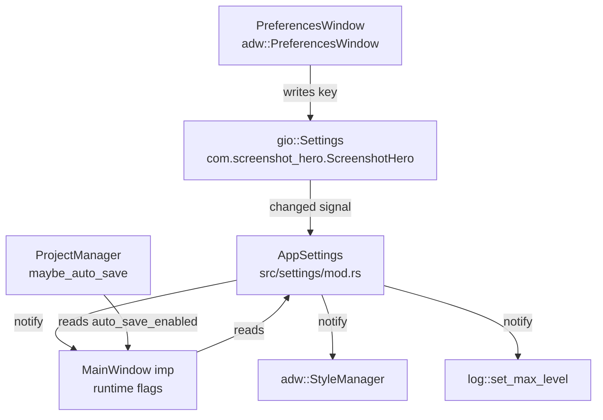

# Settings and Preferences Design

**Spec**: `.specs/features/settings-and-preferences/spec.md`  
**Status**: Draft

---

## Architecture Overview

Settings flow through three layers: GSettings backend (persistent), AppSettings wrapper (typed Rust API), and consumers (MainWindow, Application, StyleManager).



**Key principle**: `PreferencesWindow` writes directly to `gio::Settings`. The changed signal propagates to all consumers. MainWindow reads settings on startup to initialize runtime state and connects to `changed::` signals for live updates.

---

## Code Reuse Analysis

### Existing Components to Leverage

| Component | Location | How to Use |
|---|---|---|
| `MainWindow` runtime flags | `src/ui/window/imp.rs` | Replace `Cell<bool>` fields with GSettings reads; remove field declarations |
| `ProjectManager::maybe_auto_save` | `src/persistence/` | Add `auto_save_enabled` gate before calling; already called from `on_annotation_changed` |
| `auto_export` / `exporter` / `renderer` | `src/export/` | Already wired in `on_annotation_changed`; gated by `auto_export_enabled` flag |
| `env_logger` | `Cargo.toml` (not yet initialized) | Initialize in `application.rs::startup()` with builder pattern; apply GSettings level |
| `log::set_max_level` | `log` crate | Call at startup and on settings changed; controls global log dispatch |
| `libadwaita::StyleManager` | `libadwaita` | Apply `set_color_scheme()` on startup and on `color-scheme` key change |
| `adw::PreferencesWindow` | `libadwaita` (v1_0+) | Use as parent type for PreferencesWindow; provides GNOME HIG-compliant layout |
| `adw::SwitchRow` | `libadwaita` (v1_4) | Feature already enabled via `features = ["v1_4"]`; use for boolean toggles |
| `adw::ComboRow` | `libadwaita` (v1_0+) | Use for color-scheme and log-level enum selectors |
| `adw::EntryRow` | `libadwaita` (v1_4) | Use for auto-export-suffix and timestamp-format text fields |

### Integration Points

| System | Integration Method |
|---|---|
| GSettings | `gio::Settings::new("com.screenshot_hero.ScreenshotHero")` — multiple instances share the same keystore |
| Flatpak manifest | Add `glib-compile-schemas` step after source install; install schema to `${FLATPAK_DEST}/share/glib-2.0/schemas/` |
| `env_logger` | Initialize with `env_logger::Builder::new().filter_level(initial_level).init()` in `Application::startup()` |
| `log` crate | `log::set_max_level(level_filter)` at startup and on settings change; works because `log` checks max level before dispatching |

---

## GSettings Schema

**File**: `data/com.screenshot_hero.ScreenshotHero.gschema.xml`

```xml
<?xml version="1.0" encoding="UTF-8"?>
<schemalist>
  <schema id="com.screenshot_hero.ScreenshotHero"
          path="/com/screenshot_hero/ScreenshotHero/">
    <key name="color-scheme" type="s">
      <choices>
        <choice value="follow-system"/>
        <choice value="light"/>
        <choice value="dark"/>
      </choices>
      <default>'follow-system'</default>
      <summary>Application color scheme</summary>
    </key>
    <key name="timestamp-enabled" type="b">
      <default>false</default>
      <summary>Auto-add timestamp annotation on capture</summary>
    </key>
    <key name="timestamp-format" type="s">
      <default>'%Y-%m-%d %H:%M:%S'</default>
      <summary>Format string for auto-added timestamp annotation</summary>
    </key>
    <key name="auto-save-enabled" type="b">
      <default>true</default>
      <summary>Auto-save project after each annotation change</summary>
    </key>
    <key name="auto-export-enabled" type="b">
      <default>false</default>
      <summary>Auto-export annotated image after each annotation change</summary>
    </key>
    <key name="auto-export-suffix" type="s">
      <default>'_shero'</default>
      <summary>Suffix appended to filename during auto-export</summary>
    </key>
    <key name="auto-clipboard-enabled" type="b">
      <default>true</default>
      <summary>Auto-copy annotated image to clipboard after each change</summary>
    </key>
    <key name="log-level" type="s">
      <choices>
        <choice value="error"/>
        <choice value="warn"/>
        <choice value="info"/>
        <choice value="debug"/>
        <choice value="trace"/>
      </choices>
      <default>'info'</default>
      <summary>Application log level</summary>
    </key>
  </schema>
</schemalist>
```

---

## Components

### AppSettings

- **Purpose**: Typed Rust wrapper around `gio::Settings`; provides getters/setters for all 8 keys and exposes `connect_changed` for reactive updates
- **Location**: `src/settings/mod.rs`
- **Interfaces**:
  - `AppSettings::new() -> Self` — creates instance bound to `com.screenshot_hero.ScreenshotHero`
  - `color_scheme() -> ColorSchemePreference` — enum: `FollowSystem | Light | Dark`
  - `set_color_scheme(v: ColorSchemePreference)` — writes `color-scheme` key
  - `timestamp_enabled() -> bool`
  - `set_timestamp_enabled(v: bool)`
  - `timestamp_format() -> String`
  - `set_timestamp_format(v: &str)`
  - `auto_save_enabled() -> bool`
  - `set_auto_save_enabled(v: bool)`
  - `auto_export_enabled() -> bool`
  - `set_auto_export_enabled(v: bool)`
  - `auto_export_suffix() -> String`
  - `set_auto_export_suffix(v: &str)`
  - `auto_clipboard_enabled() -> bool`
  - `set_auto_clipboard_enabled(v: bool)`
  - `log_level() -> log::LevelFilter`
  - `set_log_level(v: log::LevelFilter)`
  - `connect_changed<F: Fn(&str) + 'static>(&self, f: F)` — forwards `gio::Settings::connect_changed`
- **Dependencies**: `gio::Settings`, `log::LevelFilter`
- **Reuses**: None (new module)
- **Error handling**: If schema is not found, `gio::Settings::new()` panics. Wrap in an `AppSettings::try_new() -> Option<Self>` for graceful degradation. Fall back to hardcoded defaults when `None`.

### PreferencesWindow

- **Purpose**: `adw::PreferencesWindow` subclass with four preference groups: Appearance, Timestamps, Automation, Developer
- **Location**: `src/ui/preferences/mod.rs`
- **Interfaces**:
  - `PreferencesWindow::new(settings: &AppSettings) -> Self` — builds the window with live `gio::Settings` bindings
- **Preference Groups**:

  **Appearance** (`adw::PreferencesGroup`):
  - `adw::ComboRow` — "Color Scheme" — bound to `color-scheme` key via `gio::Settings::bind()`

  **Timestamps** (`adw::PreferencesGroup`):
  - `adw::SwitchRow` — "Auto-Add Timestamp" — bound to `timestamp-enabled`
  - `adw::EntryRow` — "Timestamp Format" — bound to `timestamp-format`; sensitive only when timestamp-enabled = true

  **Automation** (`adw::PreferencesGroup`):
  - `adw::SwitchRow` — "Auto Save" — bound to `auto-save-enabled`
  - `adw::SwitchRow` — "Auto Export" — bound to `auto-export-enabled`
  - `adw::EntryRow` — "Export Suffix" — bound to `auto-export-suffix`; sensitive only when auto-export-enabled = true
  - `adw::SwitchRow` — "Auto Clipboard" — bound to `auto-clipboard-enabled`

  **Developer** (`adw::PreferencesGroup`):
  - `adw::ComboRow` — "Log Level" — bound to `log-level` key

- **Dependencies**: `AppSettings`, `libadwaita`, `gio::Settings::bind()`
- **Reuses**: Existing `adw::PreferencesWindow` pattern (follows GNOME HIG)

### MainWindow integration

- **Purpose**: Replace in-memory `Cell<bool>` / `RefCell<String>` runtime flags with GSettings-backed live reads
- **Location**: `src/ui/window/imp.rs` (modify)
- **Changes**:
  - Remove fields: `auto_clipboard_enabled: Cell<bool>`, `auto_export_enabled: Cell<bool>`, `auto_export_suffix: RefCell<String>`
  - Add field: `settings: OnceCell<gio::Settings>` — stores the shared Settings instance
  - In `on_annotation_changed` callback: replace `imp.auto_clipboard_enabled.get()` with `settings.boolean("auto-clipboard-enabled")`, etc.
  - Connect `settings.connect_changed` for live updates (no-op needed if we read from settings directly in each callback)
- **Auto-save gate**: In `on_annotation_changed`, gate `maybe_auto_save` behind `settings.boolean("auto-save-enabled")`
- **Reuses**: Existing `on_annotation_changed` callback structure

### Application startup integration

- **Purpose**: Initialize `env_logger` with the persisted log level; apply initial color scheme via `StyleManager`
- **Location**: `src/application.rs` (modify `startup()`)
- **Changes**:
  - Initialize `env_logger` with `Builder::new().filter_level(LevelFilter::Trace).init()` (capture all; level filtered by `log::set_max_level`)
  - Read `log-level` from GSettings → `log::set_max_level(level_filter)`
  - Read `color-scheme` from GSettings → `adw::StyleManager::default().set_color_scheme(scheme)`
  - Connect `settings.connect_changed` for runtime log-level and color-scheme updates
- **Reuses**: Existing `startup()` structure in `imp::Application`

---

## Data Models

### ColorSchemePreference

```rust
pub enum ColorSchemePreference {
    FollowSystem,
    Light,
    Dark,
}

impl ColorSchemePreference {
    pub fn as_str(&self) -> &'static str { ... }
    pub fn from_str(s: &str) -> Self { ... }  // defaults to FollowSystem
    pub fn to_adw(&self) -> libadwaita::ColorScheme { ... }
}
```

---

## Error Handling Strategy

| Error Scenario | Handling | User Impact |
|---|---|---|
| GSettings schema not installed | `AppSettings::try_new()` returns `None`; log warning; use hardcoded defaults | Preferences window not shown; behavior unchanged |
| Schema installed but key missing | `gio::Settings::string()` / `boolean()` returns the schema default | Transparent; no user impact |
| `env_logger` already initialized | `env_logger::Builder::try_init()` instead of `init()`; log warning on failure | Logging may not work; not user-facing |
| Invalid string value in GSettings key (e.g. unknown color-scheme) | `from_str()` defaults to `FollowSystem` / `Info` | Safe fallback |
| Auto-export suffix set to empty string | Gate in auto-export logic: fallback to `"_shero"` | Auto-export uses safe default |

---

## Tech Decisions

| Decision | Choice | Rationale |
|---|---|---|
| GSettings vs custom config file | GSettings (`gio::Settings`) | Standard GNOME mechanism; Flatpak-compatible; no extra crate |
| Multiple `gio::Settings` instances vs singleton | Multiple instances | Each caller creates its own; GSettings backend is shared; simpler lifetime management |
| `gio::Settings::bind()` for UI rows | Yes, where possible | Bidirectional binding removes manual sync code; available for bool and string keys |
| `ComboRow` for color-scheme | String keys + manual ComboRow position mapping | `gio::Settings::bind()` on enum-backed ComboRow requires custom mapping |
| `log::set_max_level()` for runtime log level | Yes | Works with `env_logger`; global `log` filter checked before dispatcher dispatch |
| `env_logger::Builder::filter_level(LevelFilter::Trace).init()` | Initialize with Trace ceiling | Lets `log::set_max_level()` control effective level at runtime without re-initializing logger |
| Where to store `gio::Settings` in MainWindow | `OnceCell<gio::Settings>` field | Consistent with existing `OnceCell<Canvas>` pattern |
| `adw::PreferencesWindow` vs custom dialog | `adw::PreferencesWindow` | GNOME HIG standard; built-in navigation and search; no layout work |

---

## Build System Changes

| File | Change |
|---|---|
| `data/com.screenshot_hero.ScreenshotHero.gschema.xml` | **New** — GSettings schema |
| `build/com.screenshot_hero.ScreenshotHero.yml` | Add: install schema to `${FLATPAK_DEST}/share/glib-2.0/schemas/`; run `glib-compile-schemas` |
| `README.md` (or `CONTRIBUTING.md`) | Add dev setup: `glib-compile-schemas data/` and `GSETTINGS_SCHEMA_DIR=data/ cargo run` |

---

## Sequence: Startup

```
main() → Application::run()
  → Application::startup()
      → env_logger::Builder::filter_level(Trace).init()
      → gio::Settings::new(...) → AppSettings
      → apply log_level() → log::set_max_level()
      → apply color_scheme() → StyleManager::set_color_scheme()
      → settings.connect_changed → runtime handlers
  → Application::activate()
      → MainWindow::new(app) — reads settings directly from gio::Settings in callbacks
      → window.present()
```

## Sequence: User Changes Setting

```
User toggles SwitchRow in PreferencesWindow
  → gio::Settings::bind() writes key
  → settings.changed signal fires
  → handler in Application: log level or color scheme updated immediately
  → handler in MainWindow on_annotation_changed: reads fresh value next time
```
