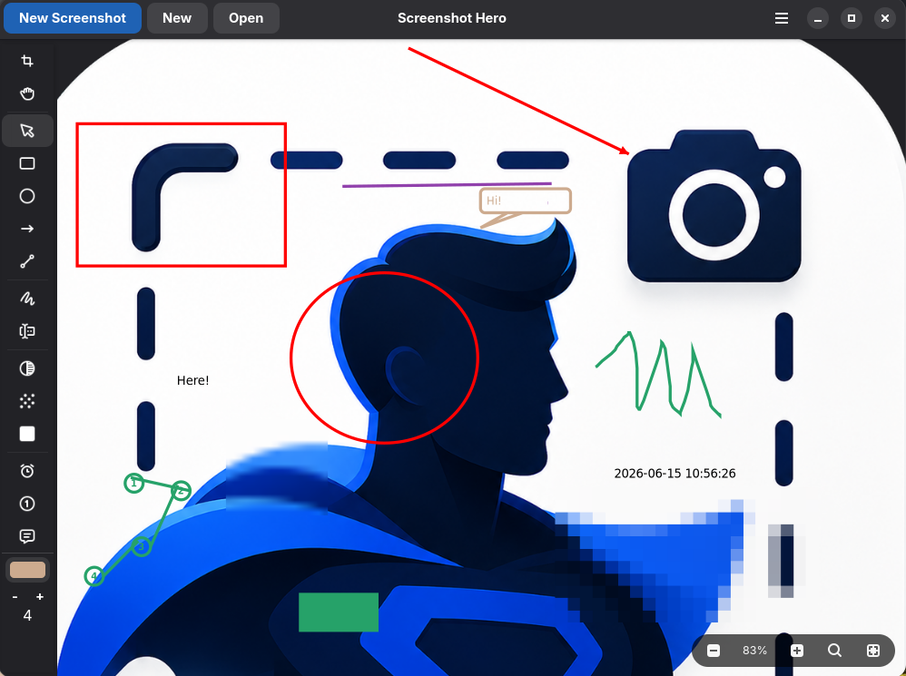
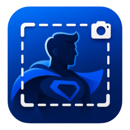
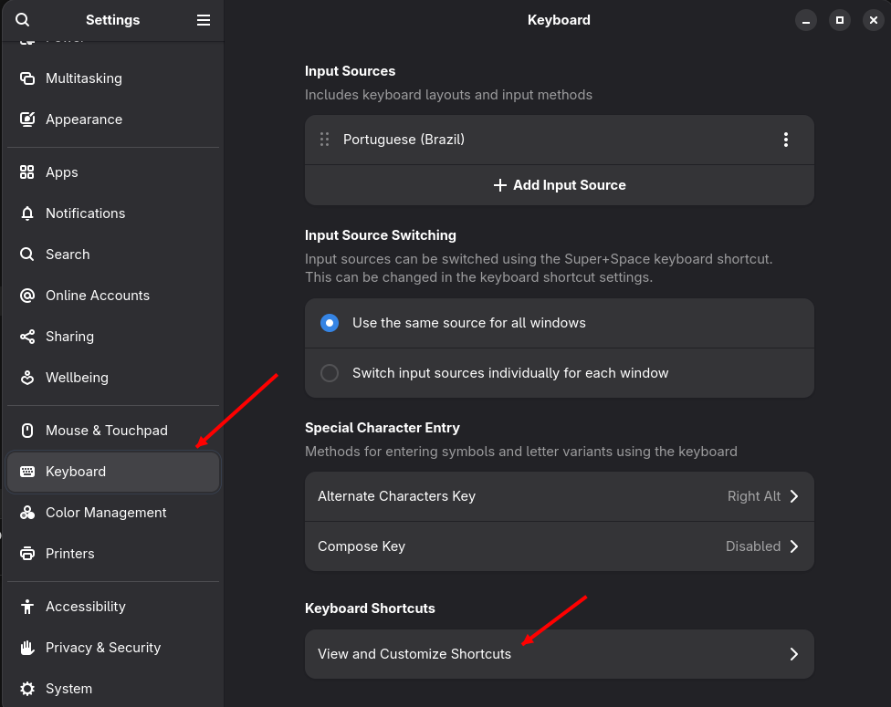
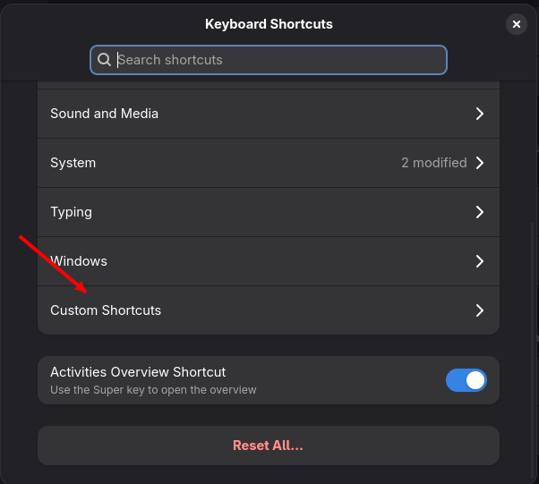
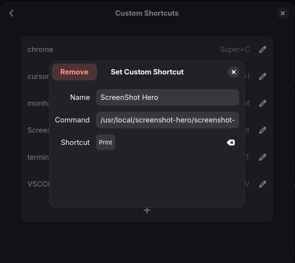

<p align="center">
  <a href="#english">🇺🇸 English</a> |
  <a href="#portugues-br">🇧🇷 Português</a>
</p>

<h1 align="center">Screenshot Hero</h1>

<p align="center">
  Capture, annotate, and share screenshots on Linux. Fully compatible with GNOME and Wayland.
</p>

<p align="center">
  
  
  
  
  
</p>



---

# 🇺🇸 English

Screenshot Hero is a Linux-native screenshot annotation app built with Rust, GTK4, and Libadwaita.

The idea for this application came from a simple gap: at the time of writing, there is no screenshot and annotation app that works seamlessly with GNOME + Wayland because of Wayland's security and privacy model.

Screenshot Hero does not try to bypass Wayland directly. Instead, it integrates with GNOME's native capture tool.

Designed for an open-source workflow, it helps you move fast through:
**Capture -> Annotate -> Export/Copy**.

## Features

- Region capture through GNOME/XDG Screenshot Portal
- Open local PNG/JPEG files
- Annotation toolkit (text, shapes, arrows, blur, pixelate, redaction, and more)
- Zoom, pan, crop, undo/redo
- Export to PNG/JPEG and copy to clipboard
- Save and load `.shero` project files
- Offline-first and privacy-first: your screenshots stay on your machine



## Quick Start

```bash
git clone https://github.com/ricrsantos/screenshot_hero.git
cd screenshot_hero
cargo run
```

Run directly in capture mode:

```bash
cargo run -- --capture
```


## Installation


### Flathub (Recommended)

```bash
flatpak install flathub dev.codethings.schero
flatpak run dev.codethings.schero
```

> Coming soon: the Flathub listing is being prepared. Until then, use the local Flatpak build steps below.


### Local Flatpak build

Manifest: `flatpak/dev.codethings.schero.yml`

Install required runtime/SDK:

```bash
flatpak install flathub org.gnome.Platform//50 org.gnome.Sdk//50
```

Build, install, and run:

```bash
flatpak-builder --user --install build-dir flatpak/dev.codethings.schero.yml --force-clean
flatpak run dev.codethings.schero
```

Flathub PR-ready manifest (for `flathub/flathub` submissions):

`flatpak/dev.codethings.schero.flathub.yml`

Capture mode with Flatpak:

```bash
flatpak run dev.codethings.schero --capture
```


### EGL/Mesa warnings in Flatpak

If you see warnings like `libEGL warning` or `MESA: ZINK` in the terminal, the app can still work normally. These messages usually indicate a GPU driver/acceleration mismatch between host and sandbox.

- The Flatpak manifest already enables GPU access with `--device=dri`.
- Check permissions with:

```bash
flatpak info --show-permissions dev.codethings.schero
```

- If warnings persist, try forcing a specific GTK renderer (test one at a time):

```bash
# OpenGL (often best when GPU acceleration works)
flatpak run --env=GSK_RENDERER=gl dev.codethings.schero

# Native OpenGL (alternative GL backend on some stacks)
flatpak run --env=GSK_RENDERER=ngl dev.codethings.schero

# Software rendering (eliminates EGL/Mesa warnings; slower, no GPU)
flatpak run --env=GSK_RENDERER=cairo dev.codethings.schero
```

These overrides are optional and useful for troubleshooting; keep the default renderer when hardware acceleration is working.

## GNOME Shortcut Tip

You can assign Screenshot Hero capture mode to a GNOME custom keyboard shortcut:

```bash
flatpak run dev.codethings.schero --capture
```

If you prefer, you can even replace GNOME's default screenshot shortcut and bind Screenshot Hero to `[PrintScr]`.

## Requirements (Development)

- Rust stable (via [rustup](https://rustup.rs/))
- GTK4 and Libadwaita development libraries
- GNOME/Wayland (or X11)
- XDG Desktop Portals (`org.freedesktop.portal.Desktop`)

**Fedora**

```bash
sudo dnf install gtk4-devel libadwaita-devel gdk-pixbuf2-devel gcc pkg-config
```

**Debian / Ubuntu**

```bash
sudo apt install libgtk-4-dev libadwaita-1-dev libgdk-pixbuf-2.0-dev build-essential pkg-config
```

**Arch Linux**

```bash
sudo pacman -S gtk4 libadwaita gdk-pixbuf-2.0 base-devel
```


## Build and Test

```bash
cargo build
cargo test --lib
```

Release build:

```bash
cargo build --release
```


## Contributing

Contributions are welcome.

1. Open an issue for bugs, UX feedback, or feature requests.
2. Fork the repo and create a branch from `main`.
3. Keep changes focused and include tests when possible.
4. Run:

```bash
cargo build
cargo test --lib
```

If you prefer, use the Flatpak helper scripts:

- `./flatpak/scripts/clean.sh` to remove local Flatpak build/repo/release artifacts
- `./flatpak/scripts/build-dev.sh` to build and install a development Flatpak locally
- `./flatpak/scripts/build-release.sh` to build a release-style Flatpak repository
- `./flatpak/scripts/package.sh` to create a `.flatpak` bundle and SHA256 checksum
- `./flatpak/scripts/run.sh` to run the installed Flatpak app (`dev.codethings.schero`)

1. Open a Pull Request with a clear description and screenshots/GIFs when UI changes are involved.


## Project Structure

```text
.
├── src/
│   ├── main.rs
│   ├── lib.rs
│   ├── application.rs
│   ├── resources.rs
│   ├── annotations/
│   ├── canvas/
│   ├── capture/
│   ├── export/
│   ├── models/
│   ├── persistence/
│   ├── settings/
│   └── ui/
├── data/
│   ├── dev.codethings.schero.desktop
│   ├── dev.codethings.schero.metainfo.xml
│   ├── dev.codethings.schero.gschema.xml
│   ├── dev.codethings.schero.gresource.xml
│   ├── icons/
│   └── resources/
├── flatpak/
│   ├── dev.codethings.schero.yml
│   ├── dev.codethings.schero.flathub.yml
│   ├── cargo-sources.json
│   └── scripts/
├── docs/
├── tests/
├── Cargo.toml
├── build.rs
└── README.md
```


## License

BSD 2-Clause. See [LICENSE](LICENSE).

---


# 🇧🇷 Português (BR)

O Screenshot Hero é um aplicativo nativo Linux para anotação de capturas de tela, desenvolvido com Rust, GTK4 e Libadwaita.

A ideia deste aplicativo surgiu de uma necessidade pessoal, pelo fato de que os aplicativos famosos do mundo Linux para captura de tela, pararam de funcionar quando o Gnome migrou do Xorg para o Wayland. Isto ocorre devido as regras de segurança e privacidade do Wayland.

O Screenshot Hero não tenta contornar o Wayland diretamente. Em vez disso, integra-se com a ferramenta nativa de captura do GNOME.

Projetado para um fluxo open source, ele ajuda você a avançar rapidamente em:
**Capturar -> Anotar -> Exportar/Copiar**.

---

## Recursos

- Captura de região via GNOME/XDG Screenshot Portal
- Abertura de arquivos locais PNG/JPEG
- Ferramentas de anotação (texto, formas, setas, blur, pixelate, redaction e mais)
- Zoom, pan, crop, desfazer/refazer
- Exportação em PNG/JPEG e cópia para a área de transferência
- Salvamento e carregamento de projetos `.shero`
- Offline e com privacidade: as imagens ficam na sua máquina


---

## Instalação

Os arquivos prontos para instação estão disponíveis para download na seção de Releases do repositório.

### A partir do pacote de instalação do binário nativo (Recomendado):

Baixar o arquivo `dev.codethings.schero-xxxxxxx-linux-x86_64.tar.gz`

obs: **xxxxxxx**, representa a versão do arquivo, quando você baixar o pacote de instalação, o valor de **x** será substituído por algo como `dev.codethings.schero-54e8cc0-linux-x86_64.tar.gz` 

Em uma pasta temporaria, descompacte o arquivo baixado:

```bash
tar -xzvf dev.codethings.schero-xxxxxxx-linux-x86_64.tar.gz
```

O contéudo descompactado deve ser algo semelhante a isso:

```bash
── dev.codethings.schero-54e8cc0
    ├── bin
    ├── dev.codethings.schero.desktop
    ├── icons
    ├── install.sh
    └── uninstall.sh
``` 

Para instalar o Screenshot Hero, acesse a pasta criada e execute o script de instalação:
```bash
cd dev.codethings.schero-54e8cc0
sudo ./install.sh
```
Se tudo ocorrer conforme o previsto, a aplicação já deve estar disponível no menu do Gnome.

Caso deseje desinstalar o Screenshot Hero, execute o scrip de remoção:
```bash
sudo ./uninstall.sh
```

### A partir do pacote Flapak

Baixar em uma pasta temporária o arquivo `scHero.flatpak`.

Execute o comando de instalação do flatpak
```bash
flatpak install ./scHero.flatpak
```

Caso você receba um erro indicando que o runtime do Flatpak do Gnome 50 não está instado, execute os comandos abaixo e posteriormente repita a instalação:
```bash
flatpak remote-add --if-not-exists flathub https://flathub.org/repo/flathub.flatpakrepo
flatpak install flathub org.gnome.Platform//50
flatpak install flathub org.gnome.Sdk//50
```

Se tudo ocorreu conforme o esperado, o Screenshot Hero já deve estar disponível no menu do Gnome.

### Caso você queira adicionar o Screenshot Hero como seu software de captura através da tecla de atalho [printscreen] (Recomendado).

1. Acesse a seção de atalhos customizados no menu de configuração do Gnome:


2. Crie um atalho para a tecla [printscreen] ou alguma outra tecla desejada:



3. No campo **Command** adicione:
- Se vc instalou via pacote binário: `screenshot-hero --capture`
- Se vc instalou via flatpak: `flatpak run dev.codethings.schero --capture`

---

## Início Rápido para desenvolvimento:

```bash
git clone https://github.com/ricrsantos/screenshot_hero.git
cd screenshot_hero
cargo run
```
Para iniciar direto no modo de captura:

```bash
cargo run -- --capture
```

### Build local com Flatpak

Manifesto: `flatpak/dev.codethings.schero.yml`

Instale o runtime/SDK necessários:

```bash
flatpak install flathub org.gnome.Platform//50 org.gnome.Sdk//50
```

Build, instalação e execução:
```bash
flatpak-builder --user --install build-dir flatpak/dev.codethings.schero.yml --force-clean
flatpak run dev.codethings.schero
```

Modo de captura com Flatpak:
```bash
flatpak run dev.codethings.schero --capture
```

### Warnings EGL/Mesa no Flatpak

Se aparecerem avisos como `libEGL warning` ou `MESA: ZINK` no terminal, o app ainda pode funcionar normalmente. Essas mensagens geralmente indicam incompatibilidade de aceleração/driver entre host e sandbox.

- O manifesto Flatpak já habilita acesso à GPU com `--device=dri`.
- Verifique as permissões com:

```bash
flatpak info --show-permissions dev.codethings.schero
```

- Se os warnings persistirem, tente forçar um renderer GTK específico (teste um de cada vez):
```bash
# OpenGL (geralmente o melhor quando a aceleração por GPU funciona)
flatpak run --env=GSK_RENDERER=gl dev.codethings.schero

# OpenGL nativo (backend GL alternativo em algumas stacks)
flatpak run --env=GSK_RENDERER=ngl dev.codethings.schero

# Renderização por software (elimina warnings EGL/Mesa; mais lento, sem GPU)
flatpak run --env=GSK_RENDERER=cairo dev.codethings.schero
```

Esses overrides são opcionais e úteis para troubleshooting; mantenha o renderer padrão quando a aceleração por hardware estiver funcionando.

---

## Requisitos (Desenvolvimento)

- Rust estável (via [rustup](https://rustup.rs/))
- Bibliotecas de desenvolvimento GTK4 e Libadwaita
- Sessão GNOME/Wayland (ou X11)
- XDG Desktop Portals (`org.freedesktop.portal.Desktop`)

**Fedora**

```bash
sudo dnf install gtk4-devel libadwaita-devel gdk-pixbuf2-devel gcc pkg-config
```

**Debian / Ubuntu**

```bash
sudo apt install libgtk-4-dev libadwaita-1-dev libgdk-pixbuf-2.0-dev build-essential pkg-config
```

**Arch Linux**

```bash
sudo pacman -S gtk4 libadwaita gdk-pixbuf-2.0 base-devel
```

---

## Build e Testes

```bash
cargo build
cargo test --lib
```

Build de release:
```bash
cargo build --release
```
Para criar o pacote de instalação com o binário nativo:
```bash
package/build-package.sh
```

---

## Como Contribuir

Contribuições são muito bem-vindas.

1. Abra uma issue para bugs, feedback de UX ou solicitações de funcionalidade.
2. Faça fork do repositório e crie uma branch a partir da `main`.
3. Mantenha as alterações focadas e inclua testes quando possível.
4. Execute:

```bash
cargo build
cargo test --lib
```

Caso voce prefira, utilize os scripts auxiliares do Flatpak:

- `./flatpak/scripts/clean.sh` para remover os artefatos locais de build/repo/release do Flatpak
- `./flatpak/scripts/build-dev.sh` para fazer build e instalar o Flatpak de desenvolvimento localmente
- `./flatpak/scripts/build-release.sh` para gerar um repositorio Flatpak no modo release
- `./flatpak/scripts/package.sh` para criar o bundle `.flatpak` e o checksum SHA256
- `./flatpak/scripts/run.sh` para executar o app Flatpak instalado (`dev.codethings.schero`)

1. Abra um Pull Request com uma descrição clara e screenshots/GIFs quando houver alterações na interface.

---

## Estrutura do Projeto

```text
.
├── src/
│   ├── main.rs
│   ├── lib.rs
│   ├── application.rs
│   ├── resources.rs
│   ├── annotations/
│   ├── canvas/
│   ├── capture/
│   ├── export/
│   ├── models/
│   ├── persistence/
│   ├── settings/
│   └── ui/
├── data/
│   ├── dev.codethings.schero.desktop
│   ├── dev.codethings.schero.metainfo.xml
│   ├── dev.codethings.schero.gschema.xml
│   ├── dev.codethings.schero.gresource.xml
│   ├── icons/
│   └── resources/
├── flatpak/
│   ├── dev.codethings.schero.yml
│   ├── dev.codethings.schero.flathub.yml
│   ├── cargo-sources.json
│   └── scripts/
├── docs/
├── tests/
├── Cargo.toml
├── build.rs
└── README.md
```

---

## Licença

BSD 2-Clause. Veja [LICENSE](LICENSE).