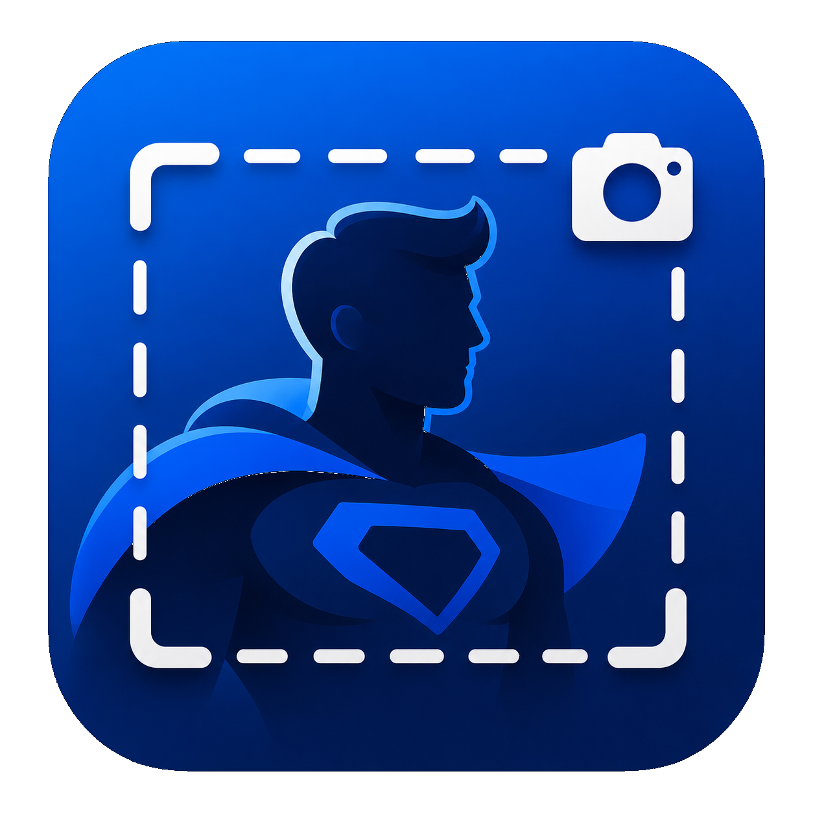

<p align="center">
  <a href="#english">🇺🇸 English</a> |
  <a href="#portugues-br">🇧🇷 Português</a>
</p>

<h1 align="center">Screenshot Hero</h1>

<p align="center">
  Capture, annotate, and share screenshots on Linux. Full compatible 
</p>

<p align="center">
  
  
  
  
</p>




---

<a id="english"></a>

## 🇺🇸 English

Screenshot Hero is a Linux-native screenshot annotation app built with Rust, GTK4, and Libadwaita.

Designed for an open source workflow, it helps you move fast through:
**Capture -> Annotate -> Export/Copy**.

### Features

- Region capture through GNOME/XDG Screenshot Portal
- Open local PNG/JPEG files
- Annotation toolkit (text, shapes, arrows, blur, pixelate, redaction, and more)
- Zoom, pan, crop, undo/redo
- Export to PNG/JPEG and copy to clipboard
- Save and load `.shero` project files
- Offline-first and privacy-first: your screenshots stay on your machine

### Project Images


### Quick Start

```bash
git clone https://github.com/ricrsantos/screenshot_hero.git
cd screenshot_hero
cargo run
```

Run directly in capture mode:

```bash
cargo run -- --capture
```

### Requirements (Development)

- Rust stable (via [rustup](https://rustup.rs/))
- GTK4 and Libadwaita development libraries
- GNOME/Wayland (or X11)
- XDG Desktop Portals (`org.freedesktop.portal.Desktop`)

**Fedora**

```bash
sudo dnf install gtk4-devel libadwaita-devel gdk-pixbuf2-devel gcc pkg-config
```

**Debian / Ubuntu**

```bash
sudo apt install libgtk-4-dev libadwaita-1-dev libgdk-pixbuf-2.0-dev build-essential pkg-config
```

**Arch Linux**

```bash
sudo pacman -S gtk4 libadwaita gdk-pixbuf-2.0 base-devel
```

### Build and Test

```bash
cargo build
cargo test --lib
```

Release build:

```bash
cargo build --release
```

### Flatpak (Primary Distribution Target)

Manifest: `build/com.screenshot_hero.ScreenshotHero.yml`

Install required runtime/SDK:

```bash
flatpak install flathub org.gnome.Platform//50 org.gnome.Sdk//50
```

Build, install, and run:

```bash
flatpak-builder --user --install build-dir build/com.screenshot_hero.ScreenshotHero.yml --force-clean
flatpak run com.screenshot_hero.ScreenshotHero
```

Capture mode with Flatpak:

```bash
flatpak run com.screenshot_hero.ScreenshotHero --capture
```

### Contributing

Contributions are welcome.

1. Open an issue for bugs, UX feedback, or feature requests.
2. Fork the repo and create a branch from `main`.
3. Keep changes focused and include tests when possible.
4. Run:

```bash
cargo build
cargo test --lib
```

5. Open a Pull Request with a clear description and screenshots/GIFs when UI changes are involved.

### Project Structure

```text
src/
├── main.rs
├── application.rs
├── capture/
├── annotations/
├── canvas/
├── export/
├── persistence/
└── ui/
build/
└── com.screenshot_hero.ScreenshotHero.yml
```

### License

BSD 2-Clause. See [LICENSE](LICENSE).

---

<a id="portugues-br"></a>

## 🇧🇷 Português (BR)

O Screenshot Hero é um aplicativo nativo Linux para anotação de capturas de tela, desenvolvido com Rust, GTK4 e Libadwaita.

Pensado para fluxo open source, ele acelera o processo:
**Capturar -> Anotar -> Exportar/Copiar**.

### Recursos

- Captura de região via portal de screenshot do GNOME/XDG
- Abertura de arquivos locais PNG/JPEG
- Ferramentas de anotação (texto, formas, setas, blur, pixelate, redaction e mais)
- Zoom, pan, crop, desfazer/refazer
- Exportação em PNG/JPEG e cópia para a área de transferência
- Salvamento e carregamento de projetos `.shero`
- Offline e com privacidade: as imagens ficam na sua máquina

### Imagens do Projeto


### Início Rápido

```bash
git clone https://github.com/ricrsantos/screenshot_hero.git
cd screenshot_hero
cargo run
```

Para iniciar direto no modo de captura:

```bash
cargo run -- --capture
```

### Requisitos (Desenvolvimento)

- Rust estável (via [rustup](https://rustup.rs/))
- Bibliotecas de desenvolvimento GTK4 e Libadwaita
- Sessão GNOME/Wayland (ou X11)
- XDG Desktop Portals (`org.freedesktop.portal.Desktop`)

**Fedora**

```bash
sudo dnf install gtk4-devel libadwaita-devel gdk-pixbuf2-devel gcc pkg-config
```

**Debian / Ubuntu**

```bash
sudo apt install libgtk-4-dev libadwaita-1-dev libgdk-pixbuf-2.0-dev build-essential pkg-config
```

**Arch Linux**

```bash
sudo pacman -S gtk4 libadwaita gdk-pixbuf-2.0 base-devel
```

### Build e Testes

```bash
cargo build
cargo test --lib
```

Build de release:

```bash
cargo build --release
```

### Flatpak (Distribuição Principal)

Manifesto: `build/com.screenshot_hero.ScreenshotHero.yml`

Instale runtime/SDK necessários:

```bash
flatpak install flathub org.gnome.Platform//50 org.gnome.Sdk//50
```

Build, instalação e execução:

```bash
flatpak-builder --user --install build-dir build/com.screenshot_hero.ScreenshotHero.yml --force-clean
flatpak run com.screenshot_hero.ScreenshotHero
```

Modo captura com Flatpak:

```bash
flatpak run com.screenshot_hero.ScreenshotHero --capture
```

### Como Contribuir

Contribuições são muito bem-vindas.

1. Abra uma issue para bugs, feedback de UX ou sugestões.
2. Faça fork do repositório e crie uma branch a partir da `main`.
3. Mantenha alterações focadas e inclua testes quando possível.
4. Execute:

```bash
cargo build
cargo test --lib
```

5. Abra um Pull Request com descrição clara e screenshots/GIFs quando houver alteração de interface.

### Estrutura do Projeto

```text
src/
├── main.rs
├── application.rs
├── capture/
├── annotations/
├── canvas/
├── export/
├── persistence/
└── ui/
build/
└── com.screenshot_hero.ScreenshotHero.yml
```

### Licença

BSD 2-Clause. Veja [LICENSE](LICENSE).
